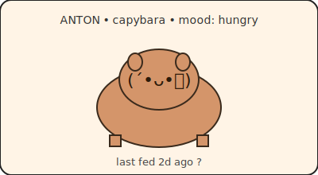

<h1 align="left">Adnan Hashmi</h1>

  <em>systems tinkerer &nbsp;&bull;&nbsp; web builder &nbsp;&bull;&nbsp; future game dev</em>

  I write Python and Rust. I care about how things work under the hood &mdash; 
  the kind of person who reads compiler output for fun. 
  Currently plotting a video game between metal albums and cat interruptions.

  <a href="mailto:mail@adnanhashmi.in">mail@adnanhashmi.in</a> &nbsp;&bull;&nbsp;
  <a href="https://www.adnanhashmi.in/">adnanhashmi.in</a>

<!-- ANTON:START -->
## Meet Anton

> Anton just ate. Last commit 6m ago. Glowing.

_Anton is a capybara who lives off Adnan's commits. Push code to feed him. Sad after 3 days, dying after 5, dead after 7. He revives on the next commit._
<!-- ANTON:END -->
